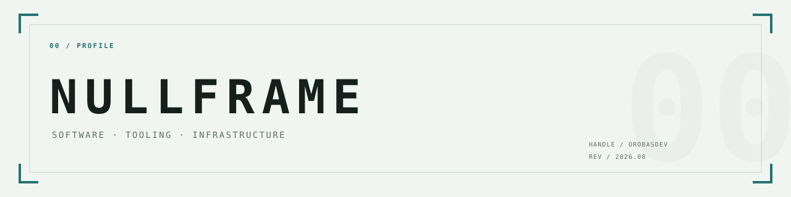
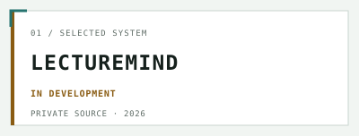
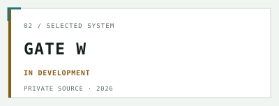
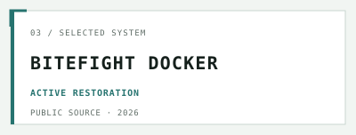

<picture>
  <source media="(prefers-color-scheme: dark)" srcset="./assets/hero-dark.svg">
  <source media="(prefers-color-scheme: light)" srcset="./assets/hero-light.svg">
  
</picture>

# NullFrame

**Software · Tooling · Infrastructure**

Education platforms, delivery infrastructure, and tooling for reliable AI-assisted engineering. Occasionally, games.

---

## Current

- `2026.08 / LECTUREMIND` — Establishing the production foundation and controlled deployment path.
- `2026.08 / NULLFRAME` — Building the public portfolio and its small, secure infrastructure baseline.
- `2026.08 / DELIVERY` — Developing evidence-driven qualification gates for repeatable engineering work.

---

## Selected systems

<picture>
  <source media="(prefers-color-scheme: dark)" srcset="./assets/project-lecturemind-dark.svg">
  <source media="(prefers-color-scheme: light)" srcset="./assets/project-lecturemind-light.svg">
  
</picture>

**LectureMind** is a learning platform for structured course material, training workflows, and classroom delivery. Its source remains private while the production and privacy foundations are completed.

<picture>
  <source media="(prefers-color-scheme: dark)" srcset="./assets/project-gate-w-dark.svg">
  <source media="(prefers-color-scheme: light)" srcset="./assets/project-gate-w-light.svg">
  
</picture>

**Gate W** is an evidence-driven qualification harness for repeatable Windows verification and controlled release gates.

<picture>
  <source media="(prefers-color-scheme: dark)" srcset="./assets/project-bitefight-docker-dark.svg">
  <source media="(prefers-color-scheme: light)" srcset="./assets/project-bitefight-docker-light.svg">
  
</picture>

**[Bitefight Docker](https://github.com/OrobasDev/bitefight-docker)** restores a legacy browser-game codebase as a local Docker environment and progressively repairs its application and gameplay flows.

---

## Capabilities

| Software | Tooling | Infrastructure |
| --- | --- | --- |
| Learning platforms | Qualification harnesses | Docker and Compose |
| Web applications | CLI workflows | Linux services |
| Structured content systems | AI-assisted engineering workflows | Deployment foundations |

---

## Elsewhere

- `nullframe.sh` — portfolio home in preparation
- [`@OrobasDev`](https://github.com/OrobasDev) — current GitHub handle

NullFrame is the engineering identity behind OrobasDev. Profile revision 2026.08. Display assets are generated from a small JSON manifest with outlined SVG text.

